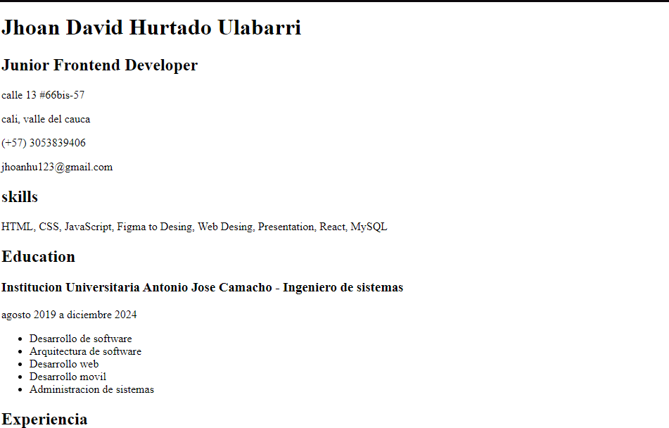
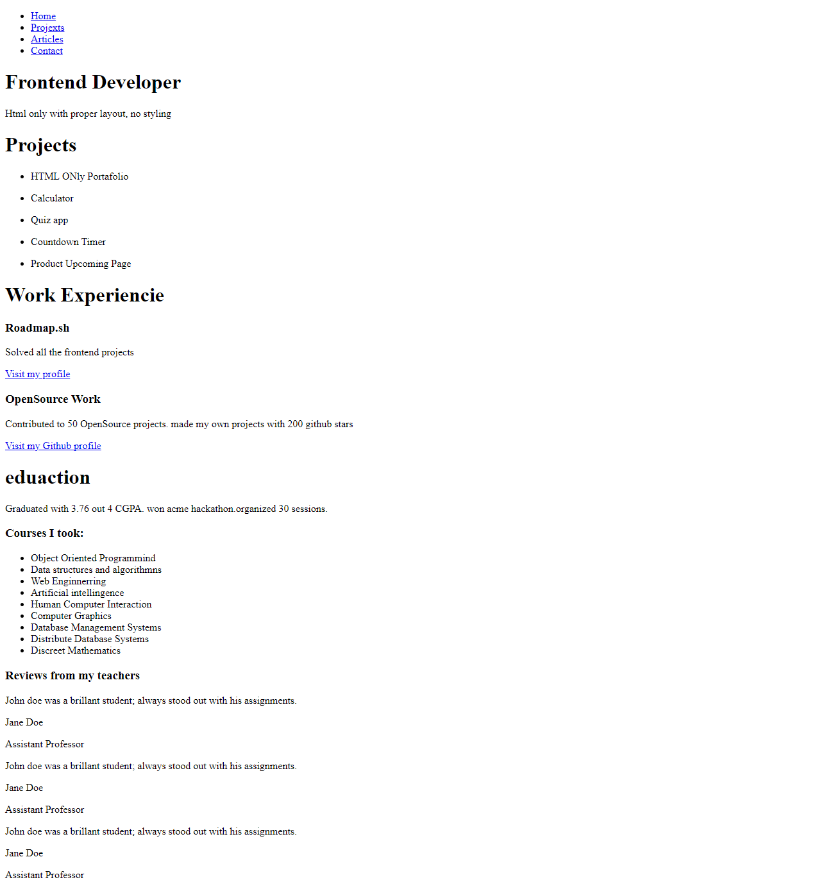

# Front-end Projects from Roadmap.sh

This repository contains front-end projects built following the [roadmap.sh](https://roadmap.sh/) front-end developer path.

## Projects List

[Single Page Cv](https://roadmap.sh/projects/single-page-cv), [Basic HTML Website](https://roadmap.sh/projects/basic-html-website)

Click any of the images below to view the readme and live demo of the project.

  <a href='Frontend Projects/1. Single-Page-Html'>
    
    
Single Page CV

  </a>
  

  <a href='Frontend Projects/2. Basic-HTML-Website'>
    
    
Basic Html Website

  </a>
